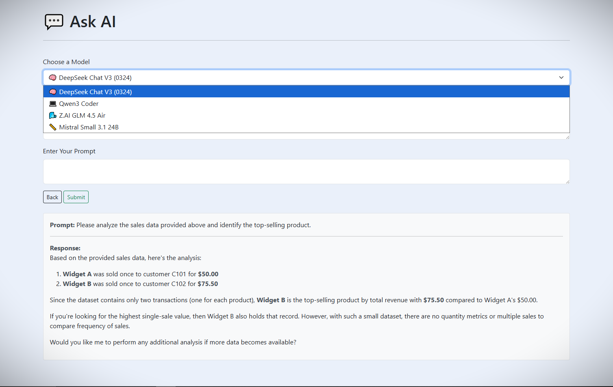

# Prompt_AI
Prompt_AI

- Provides a frontend interface for prompting various AI models via the OpenRouter API.

- Select an AI model and submit a prompt, with the response being displayed on the same page.

- #get key from the OpenRouterAI website.

 

